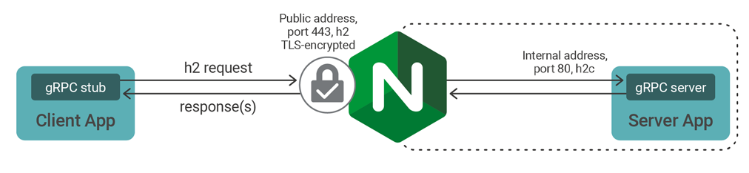

# Net Core gRPC reverse proxy Nginx

# This repository

Nginx can terminate, inspect, and route gRPC method calls.

Main use cases for Nginx with gRPC are:
- tls termination proxy,
- rate limits, 
- IP address‑based access control lists, 
- logging,
- publish multiple gRPC services through a single endpoint
- load balance a cluster of gRPC services

This repository shows how to configure Nginx as reverse proxy for gRPC. 

## Getting started

__NOTE: if you want to run example in kubernetes have a look__ [here](./README_K8s)

1. Download repository 
2. Download .Net SDK (in the moment of writing 3.1.101) & install Docker
3. Open in VS 2019 or newer
4. Start docker-compose in Visual Studio
5. Navigate to containers tab and look into client container logs

## Cleanup

- delete all docker containers
- delete all docker images
  - grpc-reverseproxy-nginx:`<tag>`
  - grpc-reverseproxy-server:`<tag>`
  - grpc-reverseproxy-client:`<tag>`

## Sources

- https://www.nginx.com/blog/nginx-1-13-10-grpc/
- https://www.nginx.com/blog/deploying-nginx-plus-as-an-api-gateway-part-3-publishing-grpc-services/